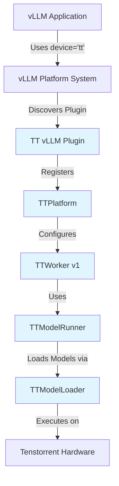
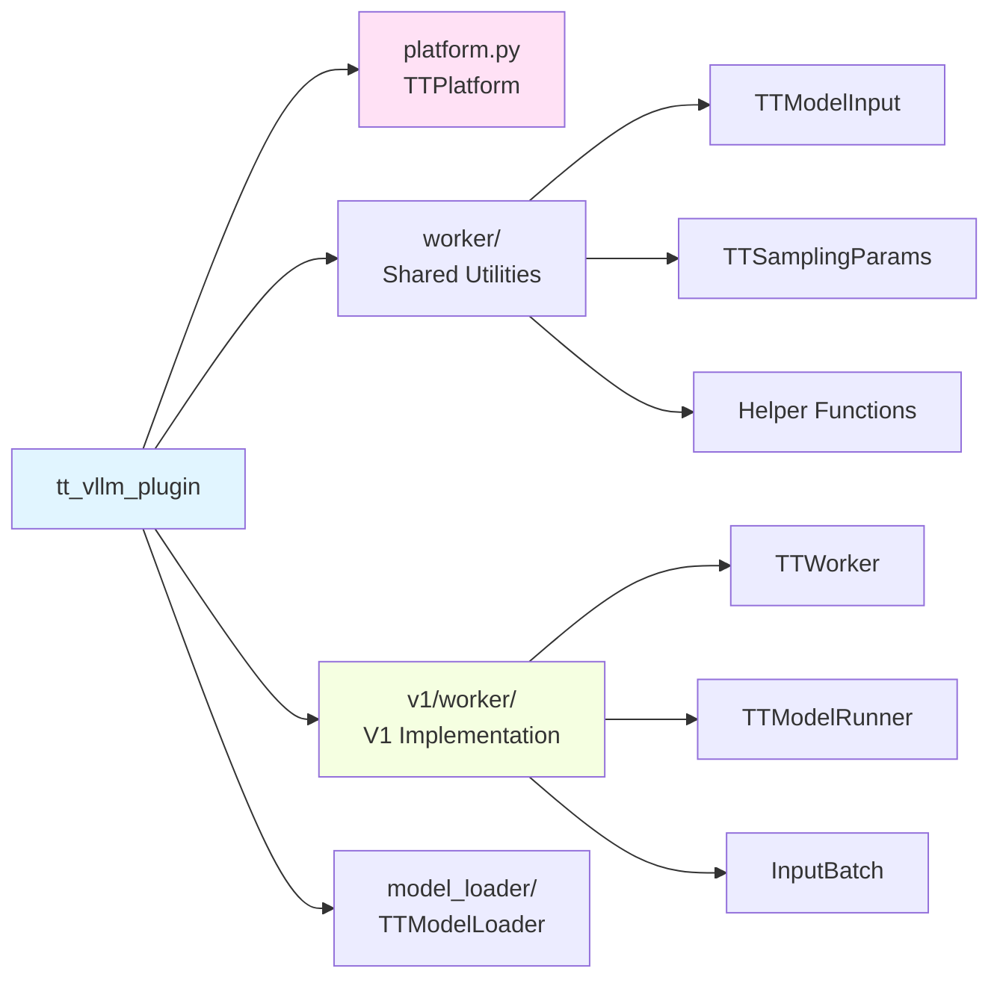

# TT vLLM Plugin

A vLLM plugin that enables running Large Language Models (LLMs) on Tenstorrent hardware using the vLLM v1 architecture.

## Overview

This plugin extracts the Tenstorrent (TT) platform implementation from the `tt-vllm` fork and packages it as a standalone, installable vLLM plugin. It provides seamless integration with vLLM's plugin system, allowing you to use Tenstorrent hardware acceleration without modifying the vLLM codebase.

## Architecture

The plugin integrates with vLLM's platform plugin system, which automatically discovers and loads the plugin when TT hardware is available.



### Component Structure



## Installation

### Prerequisites

- Python 3.11
- vLLM (compatible with v1 architecture)
- Tenstorrent hardware with `ttnn` library installed
- Set `VLLM_USE_V1=1` environment variable

### Install the Plugin

```bash
# Clone or download the plugin
cd tt-vllm-plugin

# Install in development mode
pip install -e .

# Or build a wheel
python setup.py bdist_wheel
pip install dist/tt_vllm_plugin-*.whl
```

### Verify Installation

```bash
# Check that the plugin is discoverable
python -c "from importlib.metadata import entry_points; print([ep.name for ep in entry_points(group='vllm.platform_plugins')])"
```

You should see `tt` in the list of available platform plugins.

## Usage

### Basic Example

```python
import os
os.environ["VLLM_USE_V1"] = "1"

from vllm import LLM, SamplingParams

# Initialize LLM with TT platform
llm = LLM(
    model="meta-llama/Llama-3.1-8B-Instruct",
    device="tt",  # Plugin automatically loads
    max_model_len=2048,
    max_num_seqs=1,
    override_tt_config={
        "trace_mode": True,
    }
)

# Generate text
sampling_params = SamplingParams(temperature=0.0, top_p=1.0, max_tokens=50)
outputs = llm.generate(["Hello, my name is"], sampling_params)
print(outputs[0].outputs[0].text)
```

### Running the Example

```bash
export VLLM_USE_V1=1
python examples/llama_3_1_8b_instruct.py
```

## Configuration

The plugin supports various TT-specific configuration options via `override_tt_config`:

```python
override_tt_config = {
    "trace_mode": True,  # Enable ttnn tracing for model execution
    "sample_on_device_mode": "decode_only",  # "all", "decode_only", or None
    "dispatch_core_axis": "row",  # "row" or "col"
    "fabric_config": "FABRIC_1D",  # Fabric configuration
    "trace_region_size": 50000000,  # Trace region size
    "worker_l1_size": <size>,  # Worker L1 size
    "l1_small_size": <size>,  # L1 small size
}
```

## Testing

### Offline Inference Test

```bash
export VLLM_USE_V1=1
pytest tt_vllm_plugin/tests/test_offline_inference.py -v
```

The test verifies basic offline inference functionality with the Llama-3.1-8B-Instruct model.

## Compatibility

### vLLM Version

- **Target**: Latest vLLM with v1 architecture support
- **Minimum**: vLLM 0.7.0+
- **Architecture**: vLLM v1 only (requires `VLLM_USE_V1=1`)

### Python Version

- **Required**: Python 3.11

### Dependencies

- **vLLM**: Version should match your vLLM installation
- **torch**: Version should match vLLM's requirements (typically provided by vLLM)
- **ttnn**: Platform-specific, install separately based on your Tenstorrent hardware setup
- **transformers**: >=4.40.0

### Known Limitations

1. **v1 Architecture Only**: The plugin only supports vLLM v1 architecture. Set `VLLM_USE_V1=1` before importing vLLM.

2. **Model Support**: Currently supports models that have TT-specific implementations (models with "TT" prefix in architecture name).

3. **Feature Limitations**:
   - Chunked prefill: Not supported
   - Speculative decoding: Not supported
   - LoRA: Not supported
   - Prefix caching: Not supported
   - Distributed execution: Not supported (TP/PP size must be 1)
   - Encoder-decoder models: Limited support in V1

4. **Dependency Conflicts**: 
   - The plugin avoids hard-pinning torch versions to prevent conflicts
   - Ensure your vLLM and torch versions are compatible
   - If using with other TT packages (e.g., `pjrt-plugin-tt`), ensure torch version compatibility

## Troubleshooting

### Plugin Not Discovered

- Verify installation: `pip list | grep tt-vllm-plugin`
- Check entry points: `python -c "from importlib.metadata import entry_points; print(list(entry_points(group='vllm.platform_plugins')))"`
- Ensure `VLLM_USE_V1=1` is set before importing vLLM

### TT Hardware Not Available

- Verify `ttnn` is installed and accessible
- Check device availability: `python -c "import ttnn; print(ttnn.get_device_ids())"`
- The plugin will return `None` from `register()` if TT hardware is not available

### Import Errors

- Ensure all dependencies are installed: `pip install -r requirements.txt`
- Verify vLLM is installed and compatible
- Check that Python version is 3.11

### Model Loading Issues

- Verify the model has a TT-specific implementation
- Check that the model architecture name starts with "TT" (automatically prepended by the plugin)
- Ensure model files are accessible

## Development

### Project Structure

```
tt-vllm-plugin/
├── setup.py                 # Package setup
├── pyproject.toml          # Modern Python packaging
├── requirements.txt        # Runtime dependencies
├── README.md               # This file
├── tt_vllm_plugin/         # Main package
│   ├── __init__.py         # Plugin registration
│   ├── platform.py         # TTPlatform implementation
│   ├── worker/             # Shared utilities
│   │   ├── tt_model_runner.py  # TTModelInput, TTSamplingParams
│   │   └── tt_worker.py         # Helper functions
│   ├── v1/                 # V1 architecture implementation
│   │   └── worker/
│   │       ├── tt_worker.py      # V1 TTWorker
│   │       ├── tt_model_runner.py # V1 TTModelRunner
│   │       └── tt_input_batch.py  # InputBatch
│   ├── model_loader/       # Model loading
│   │   └── tt_loader.py     # TTModelLoader
│   └── tests/              # Tests
│       └── test_offline_inference.py
└── examples/               # Example scripts
    └── llama_3_1_8b_instruct.py
```

### Building

```bash
# Build wheel
python setup.py bdist_wheel

# Install from wheel
pip install dist/tt_vllm_plugin-*.whl
```

## License

Apache-2.0

## Contributing

This plugin is extracted from the `tt-vllm` fork. For issues or contributions related to the TT platform implementation, please refer to the original repository or Tenstorrent's internal development processes.

## References

- [vLLM Plugin System Documentation](https://docs.vllm.ai/en/stable/design/plugin_system.html)
- [vLLM v1 Architecture Blog](https://blog.vllm.ai/2025/01/27/v1-alpha-release.html)
- [Tenstorrent Documentation](https://tenstorrent.com)

