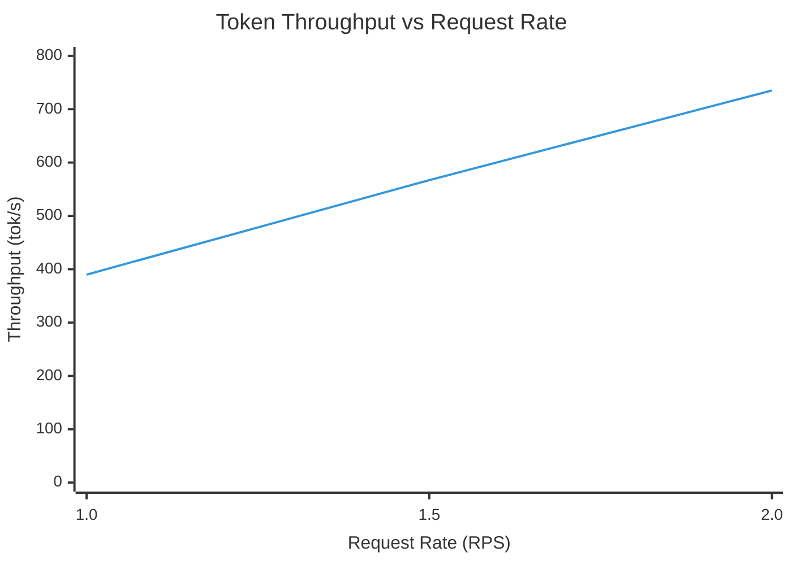
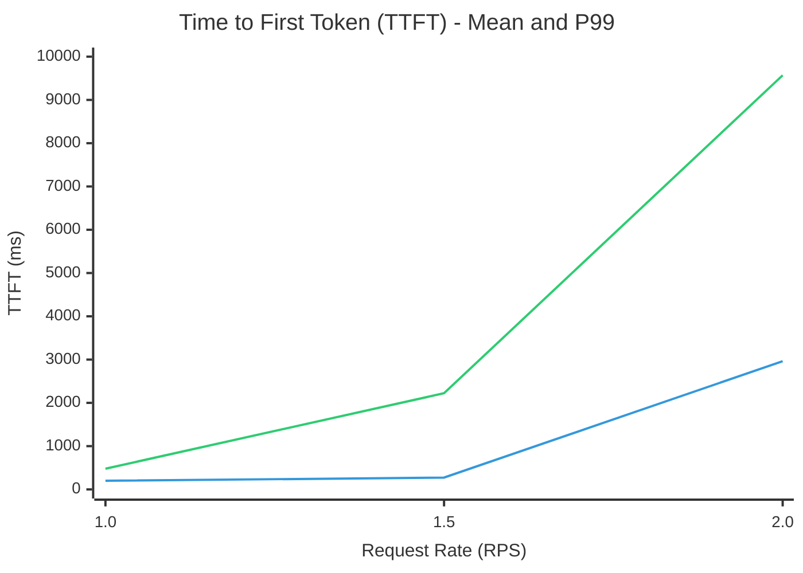
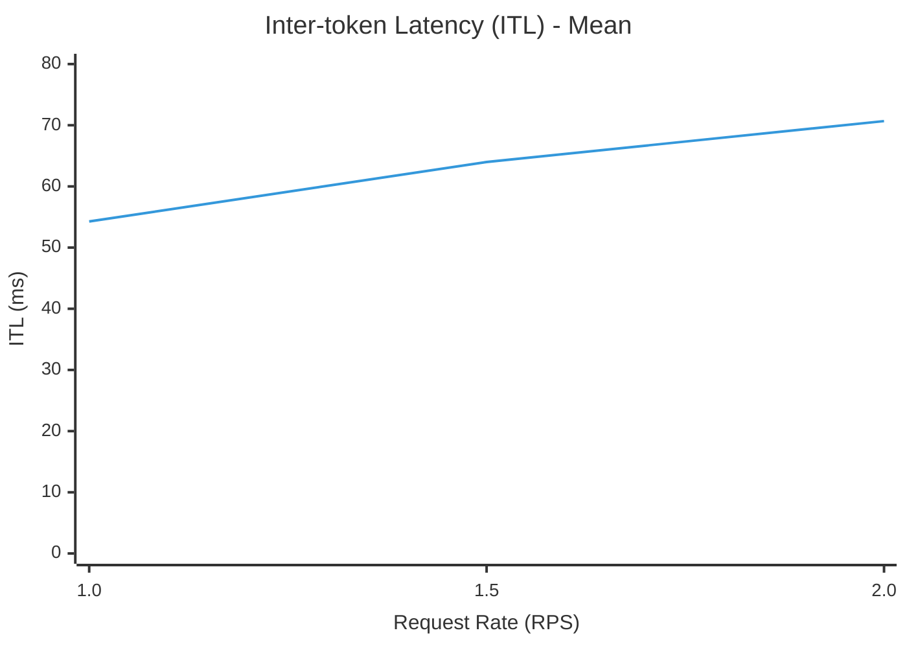

# TT vLLM Plugin

A vLLM plugin that enables running Large Language Models (LLMs) on Tenstorrent hardware using the vLLM v1 architecture.

## Overview

This plugin extracts the Tenstorrent (TT) platform implementation from the [vllm fork](https://github.com/tenstorrent/vllm/tree/dev) and packages it as a standalone, installable vLLM plugin.

## Installation

### Prerequisites

- Release version of the `tt-metal`
- Set `VLLM_USE_V1=1` environment variable

### Install the Plugin

You have to be in the `tt-metal` python environment to install the plugin.

```bash
source tt-metal/python_env/bin/activate
```

Then, you can install the plugin and its dependencies:
```bash
cd tt-vllm-plugin
pip install -e .
```

In case there are dependency conflicts run this:
```
pip install "vllm<0.11" "torch==2.7.1+cpu" "torchvision==0.22.1+cpu" "numpy==1.26.4"
```

### Verify Installation

Verify `tt-metal` is working correctly by running:
```bash
python examples/ttnn_test.py
```

Then verify vLLM plugin is installed correctly by running:
```bash
python examples/llama_3_1_8b_instruct.py
```

You should see `tt` in the list of available platform plugins.

```
INFO 11-28 13:51:29 [__init__.py:36] Available plugins for group vllm.platform_plugins:
INFO 11-28 13:51:29 [__init__.py:38] - tt -> tt_vllm_plugin:register
INFO 11-28 13:51:29 [__init__.py:41] All plugins in this group will be loaded. Set `VLLM_PLUGINS` to control which plugins to load.
INFO 11-28 13:51:29 [__init__.py:232] Platform plugin tt is activated
```

## Limitations

- Supports only v1 architecture
- `override_tt_config` supported by [the fork](https://github.com/tenstorrent/vllm/tree/dev) is not supported in the plugin.

## Performance measurements

Performance benchmarks for `meta-llama/Llama-3.1-8B-Instruct` on N150 using vLLM online inference.

### Benchmark Results

| Metric | RPS=1 | RPS=1.5 | RPS=2 |
|--------|-------|---------|-------|
| **Request Rate Configured (RPS)** | 1.00 | 1.50 | 2.00 |
| **Request Throughput (req/s)** | 0.94 | 1.37 | 1.78 |
| **Output Token Throughput (tok/s)** | 199.73 | 290.49 | 376.65 |
| **Total Token Throughput (tok/s)** | 389.86 | 567.01 | 735.19 |
| **Mean TTFT (ms)** | 199.34 | 273.14 | 2962.19 |
| **Median TTFT (ms)** | 165.70 | 185.29 | 1696.19 |
| **P99 TTFT (ms)** | 478.80 | 2222.49 | 9569.23 |
| **Mean TPOT (ms)** | 55.20 | 66.63 | 72.33 |
| **Median TPOT (ms)** | 53.78 | 64.45 | 71.46 |
| **P99 TPOT (ms)** | 90.67 | 135.37 | 125.78 |
| **Mean ITL (ms)** | 54.28 | 63.99 | 70.68 |
| **Median ITL (ms)** | 45.13 | 48.19 | 49.37 |
| **P99 ITL (ms)** | 283.43 | 364.83 | 364.22 |
| **Benchmark Duration (s)** | 530.66 | 364.87 | 281.40 |
| **Successful Requests** | 500 | 500 | 500 |

*TTFT: Time to First Token, TPOT: Time per Output Token, ITL: Inter-token Latency*

### Performance Trends







The performance drops with 2 requests per second, as prefills are done in sequence for all models from tt_transformers library.
To address this, [issue #33381](https://github.com/tenstorrent/tt-metal/issues/33381) is created.

## References

- [vLLM Plugin System Documentation](https://docs.vllm.ai/en/stable/design/plugin_system.html)
- [vLLM v1 Architecture Blog](https://blog.vllm.ai/2025/01/27/v1-alpha-release.html)
- [Tenstorrent Documentation](https://tenstorrent.com)

